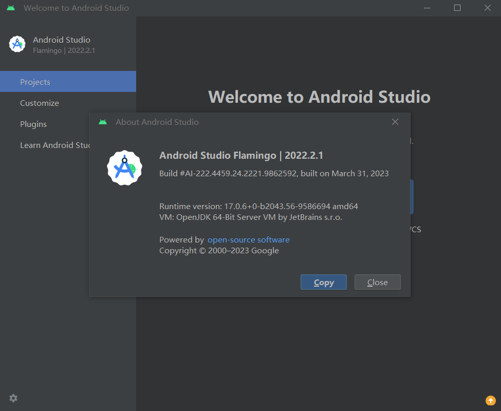

# 实验一
## 安装Android Studio

## 安装Anaconda
• 开始 → Anaconda3 （64-bit ） → Anaconda Navigator(anaconda3)，启动成功说明安装成功

• 开始 → Anaconda3（64-bit）→ 右键点击Anaconda Prompt→ 以管理员身份运行”，在Anaconda Prompt中输入 conda
list ，可以查看已经安装的包名和版本号。若结果可以正常显示，则说明安装成功。

## 安装VS code
