## 创建第一个Kotlin应用
### 选择创建一个Basic Activity，选择Kotlin语言，并命名应用程序
打开Android Studio，选择Projects>New Project，然后选择Basic Activity.
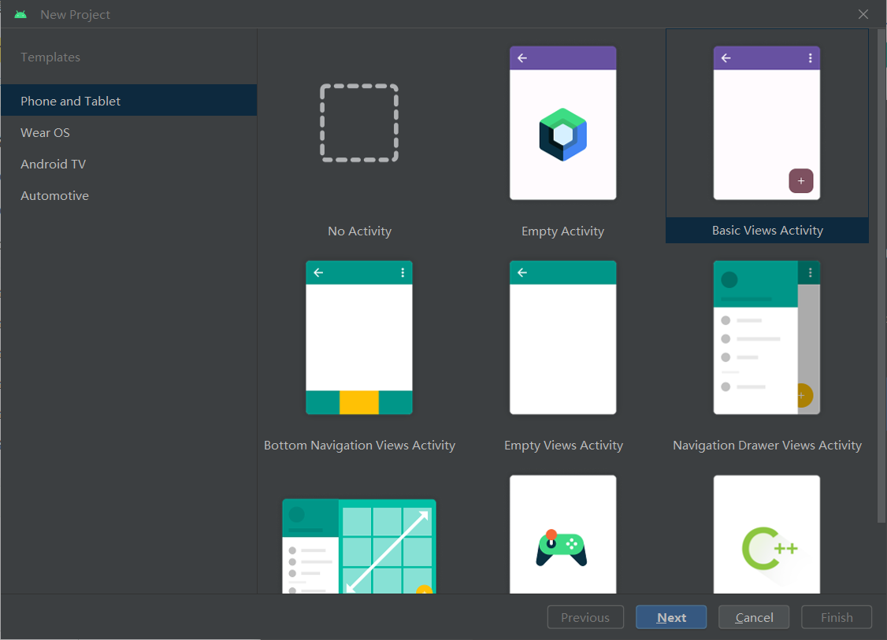
### 创建虚拟设备（模拟器）
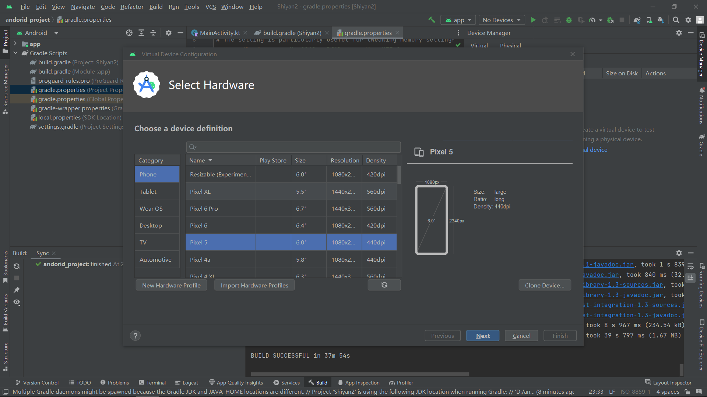
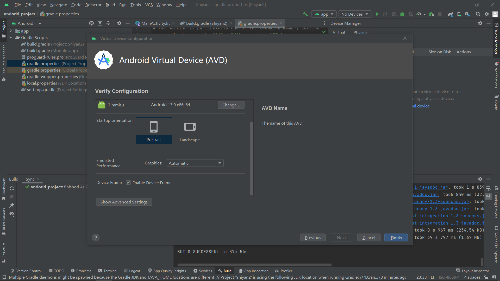
### 应用程序运行效果图
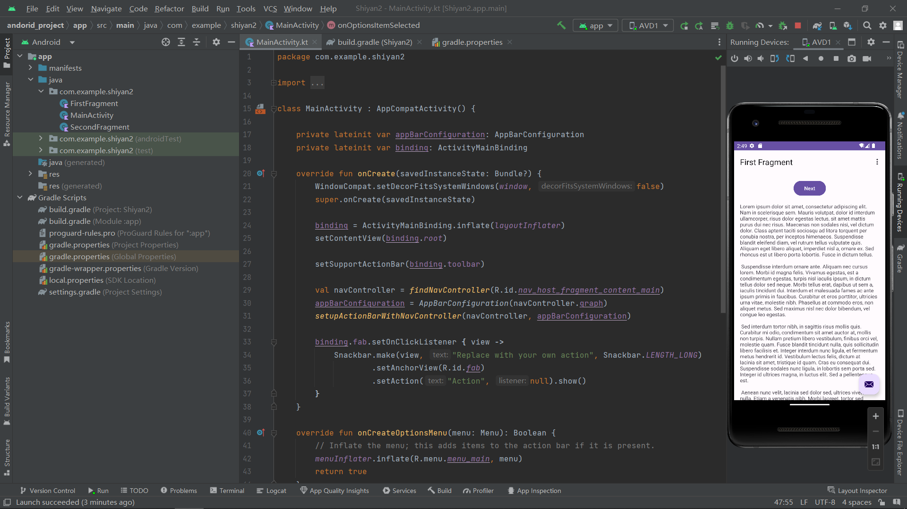
### 修改视图属性 
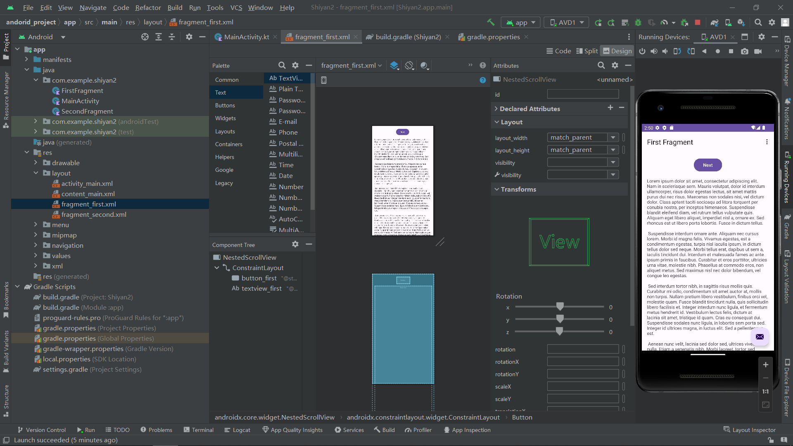
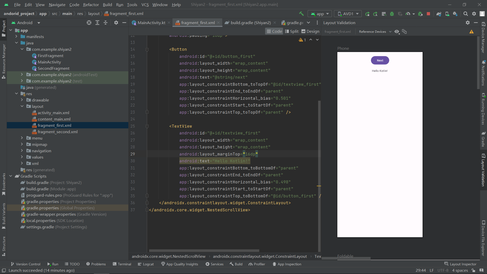
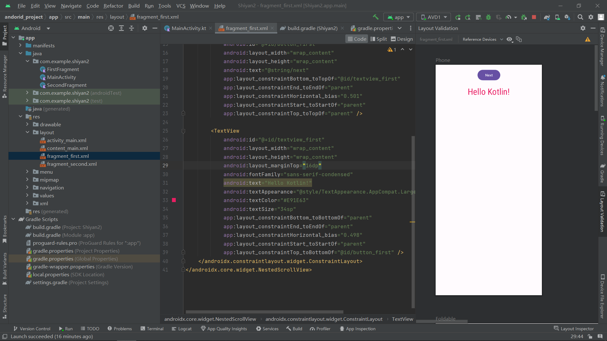
### 向页面添加组件并完成交互代码
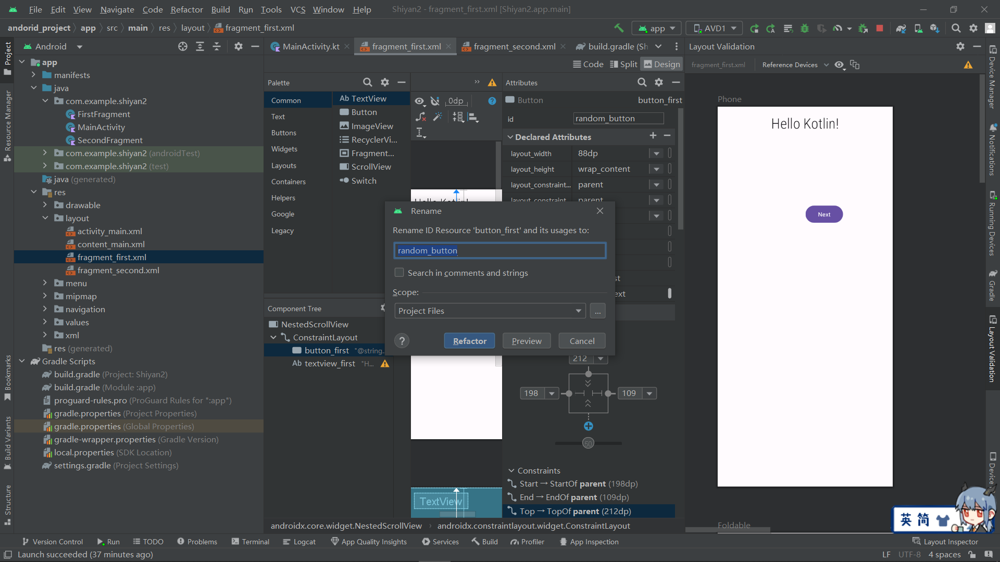
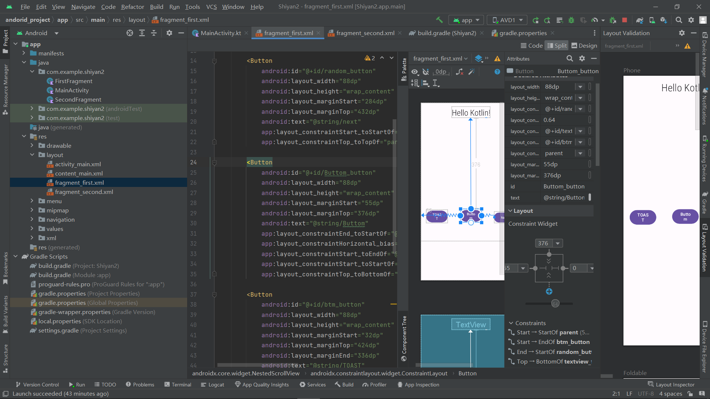
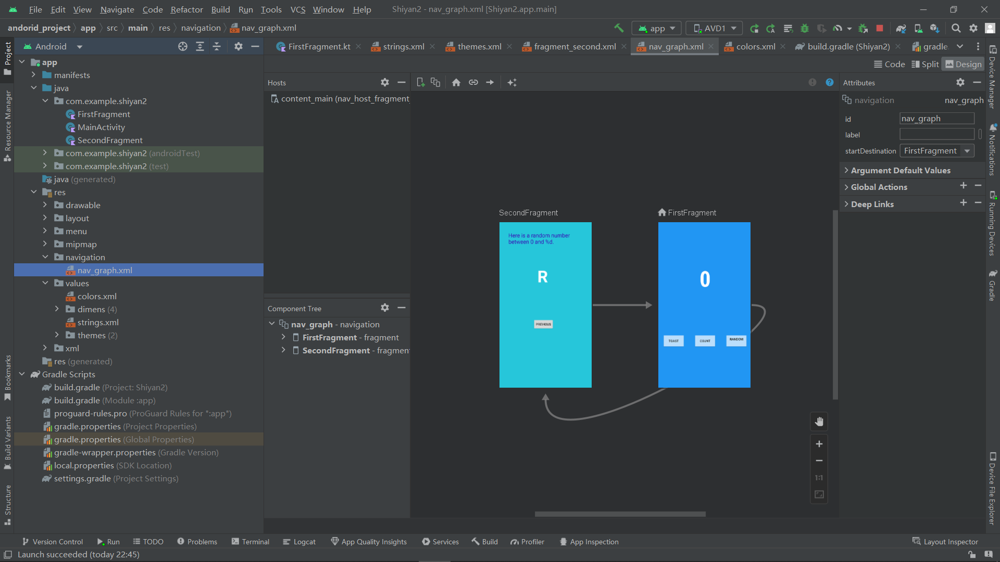
### 最终实现效果图
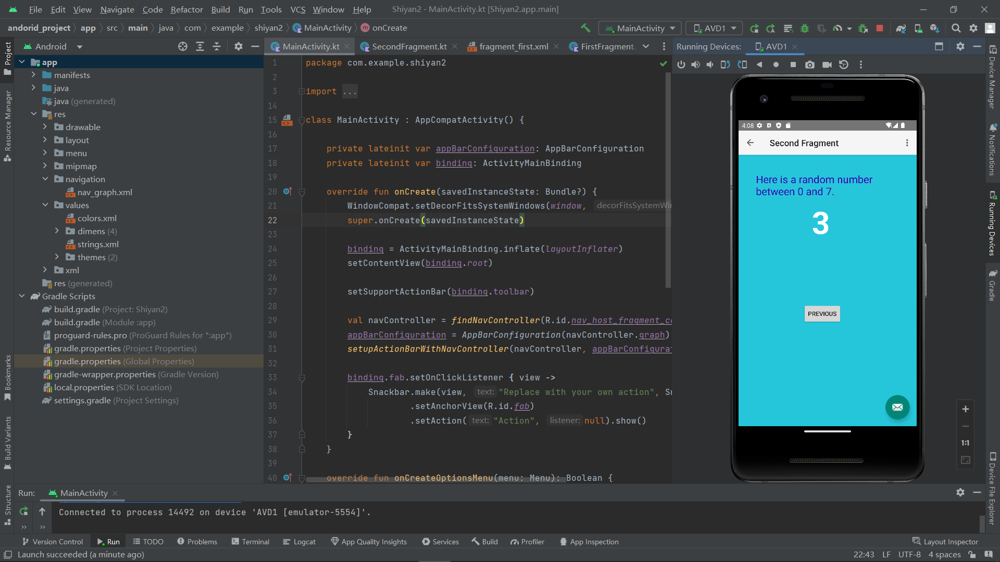
