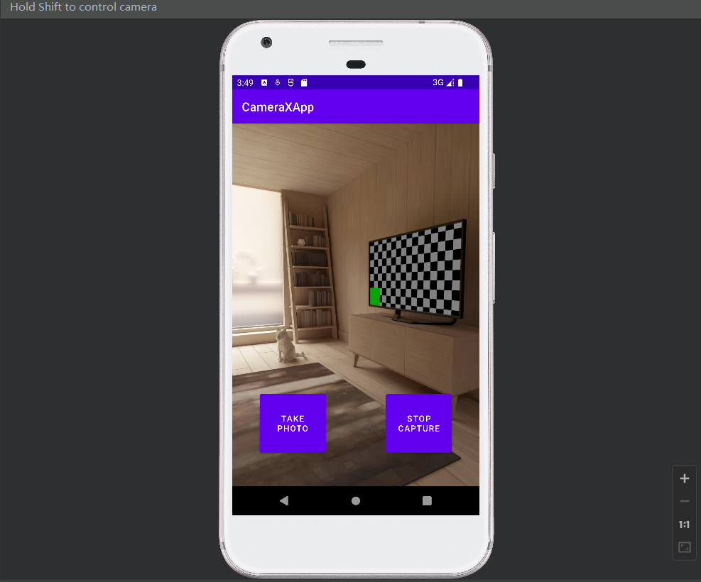

## Android CameraX的基础使用  
### 实验内容  
- CameraX是Android最新的支持开发相机应用的Jetpack
库（API level 21以上）
- 本实验将按照教程完成CameraX APP的构建  
- 要求上传代码至Github，并撰写详细的Readme文档  

### 创建项目  

  
### 添加 Gradle 依赖  
 
### 请求必要的权限  
  
### 实现 Preview 用例  
   
 ### 实现 ImageCapture 用例（拍照功能）
 
  

### 实现 ImageAnalysis 用例

 
  

### 实现VideoCapture用例
  
  
