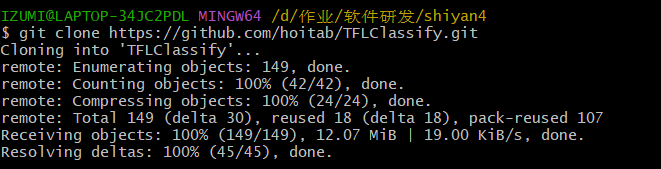
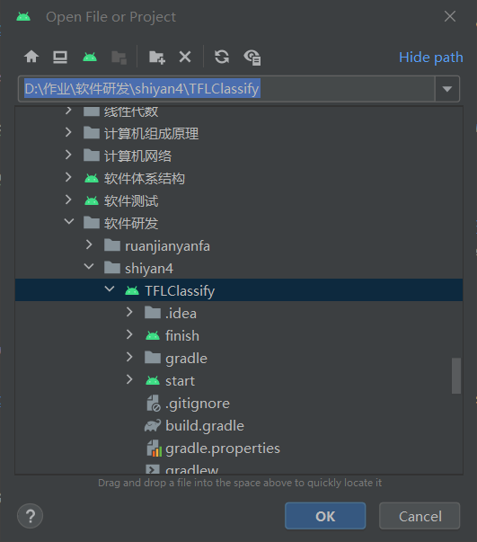
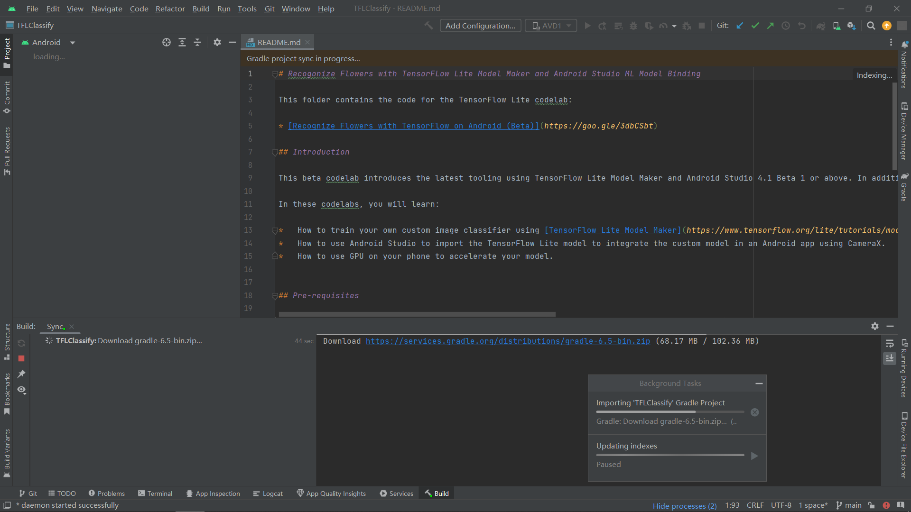
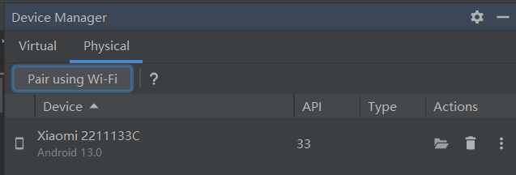
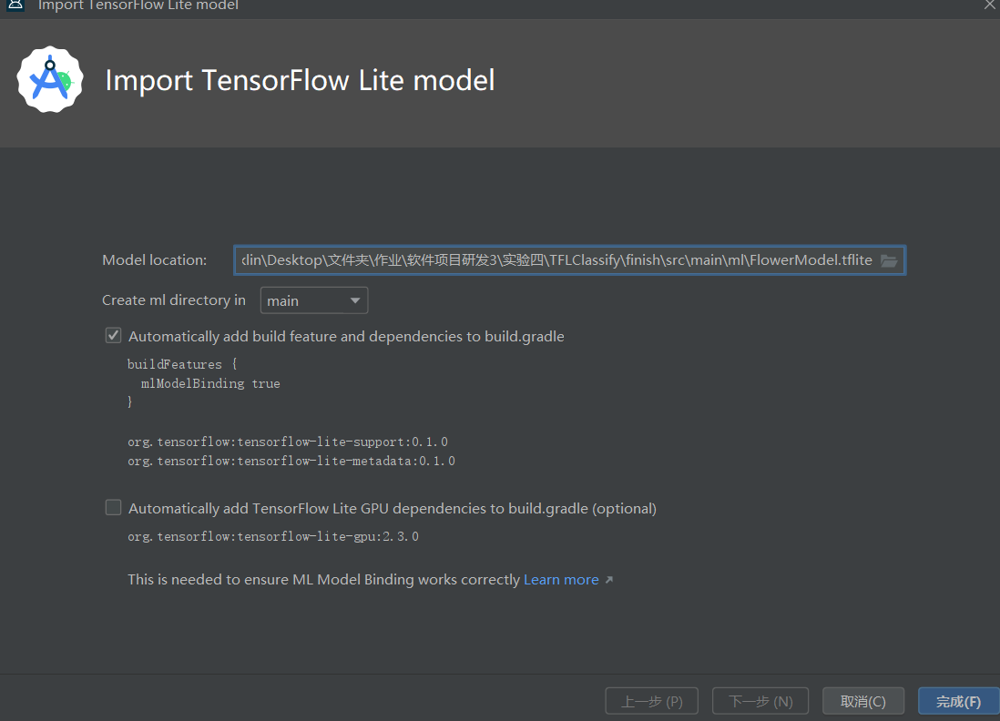
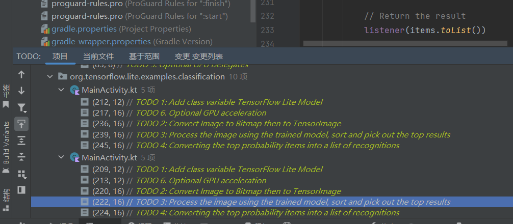

## 基于TensorFlow Lite实现的Android花卉识别应用
### 实验内容
本教程将在Android设备上使用TensorFlow Lite运行图像识别模型，具体包括：

1. 按照教程构建基于TensorFlow Lite的Android花卉识别应用。
2. 查看该应用的代码框架，特别注意CameraX 库(AndroidX.camera.*)和数据视图模型的使用。
3. 上传完成既定功能的代码至Github，并撰写详细的Readme文档。
### 预备工作  
创建工作目录

  
### 运行初始代码    
  
下载相应的gradle wrapper 。  
  
运行start模块  
  
运行结果：  
    
 ### 向应用中添加TensorFlow Lite

    
 
   
### 检查代码中的TODO项  
本项目初始代码中包括了若干的TODO项，以导航项目中未完成之处。  
   
### 添加代码重新运行APP  

  

   
